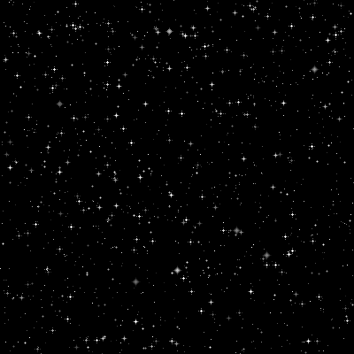

## Starry Sky

A python script for generating animated starry skies.



The above example was generated with seed 130388

## Usage

```
# Generate a random GIF
starry-sky.py 

# Supply a seed
starry-sky.py -s 130388

# Run in interactive mode (w/optional seed)
starry-sky.py -i -s 130388
```

## Interactive Mode

Interactive mode allows the user to modify simulation parameters, observing changes in real time.
